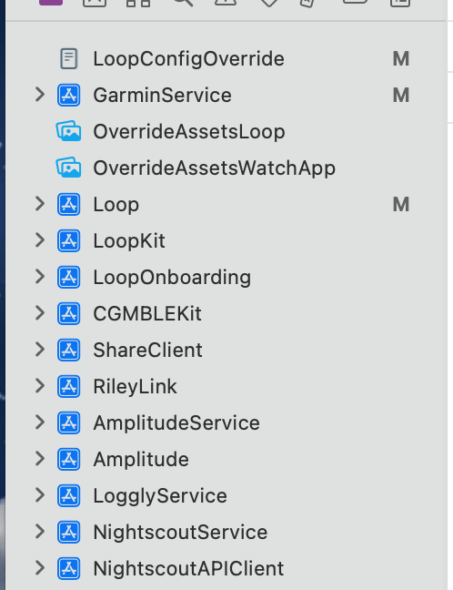

# Garmin Service

This integration allows to use Loop with Garmin ecosystem (IQConnect). The system allows to create watchfaces, datafields ou appfields with the information provided by Loop for diabetics close loop.

See https://github.com/LoopKit/LoopWorkspace 

The integration is a fork of FreeAPSX/Garmin branch provided by Ivalkou and modify to Loop strategy. https://github.com/ivalkou/freeaps Thanks a lot !

The service is **VERY experimental**

After installing the Garmin Service, we need to compile and upload a watchface or DataField in your Garmin Device. 
WatchFace  : https://github.com/avouspierre/LoopGarminWatchFace 

Data Field : https://github.com/avouspierre/LoopGarminDataField 

# Install

(A video example with a other plugin : https://www.youtube.com/watch?v=7qWNzkWtUfQ)

## Add the service in the LoopWorkspace

`git submodule add -b master https://github.com/avouspierre/GarminServiceLoop.git GarminService`

## Add the service in Xcode 

Open Loop.xcworkspace

### Add the GarminService.xcodeProj in the Loop Workspace 

Drag GarminService.xcodeproj from the Finder (from the GarminService submodule) into the xcode left menu while having the loop workspace open

### Add the GarminService in the compilation 

Select the "Loop (Workspace)" scheme and then "Edit scheme.."
In the Build Dialog, make sure to add GarminServiceKitPlugin as a build target, and place it just before "ShareClientPlugin" 5 In Xcode this can be accessed from the top menu Product -> Scheme -> Edit Scheme

## Modify Loop to add the URL notification 

The hack is required to do the linkg between Loop and Garmin Connect App : 

Open Loop > Loop > AppDelegate.Swift and add a new function (line 93 before the last bracket )

    func application(_ application: UIApplication, open url: URL, options: [UIApplication.OpenURLOptionsKey : Any] = [:]) -> Bool {
        let components = URLComponents(url: url, resolvingAgainstBaseURL: false)
        let openFromGarminConnect = Notification.Name("Notification.Name.openFromGarminConnect")
        switch components?.host {
        case "device-select-resp":
            NotificationCenter.default.post(name: openFromGarminConnect, object: url)
            return true
        default:
            return false
        }
        
    }

## Compile the code

Just go !  

- In xcode, go to Product->"Clean Build Folder"
- Make sure you build "Loop (Workspace)" rather than "Loop"

## Add WatchFace or DataField in your Garmin Device

See Garmin IQConnect how to install SDK and compile with your correct device. 
https://developer.garmin.com/connect-iq/connect-iq-basics/getting-started/#gettingstarted 

Watch Face : https://github.com/avouspierre/LoopGarminWatchFace 

Data Field : https://github.com/avouspierre/LoopGarminDataField 

# Use

You need to install in your IOS Phone the Garmin Connect App and configure the App with your device. 

After installing, add in Settings > Services the Garmin Service : 

Use the link "Select Device". The Garmin Connect App is launched in the foreground and the Loop app is launched again. Your device must appear in the last.

The configuration is done ! 

Select your watch face in your device and the information provided by Loop should be appear in less 5 minutes (the Loop cycle)

# Caution 

The solution use the Service Loop Configuration. This service is more provided to upload data in Web Services and have some limitations for this use. 
If your CGM does not include Glucose Upload, the service will not able to display the trend. It will display the glucose value and the delta but not the trend. 

# Todo 

Better management of the loop status 

